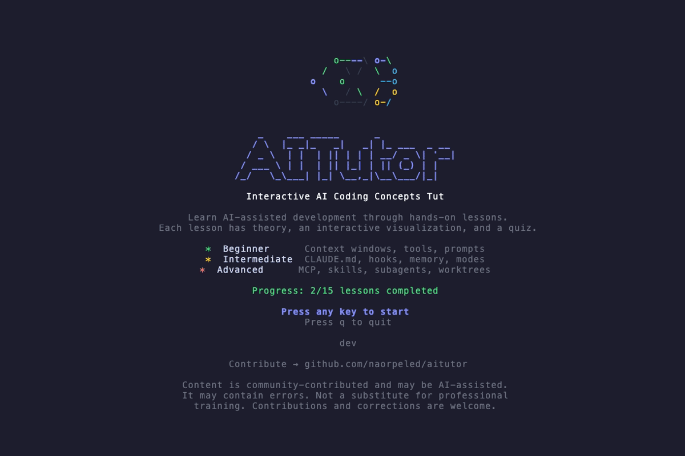

# AITutor

Interactive terminal-based tutorial for AI coding concepts. Learn context windows, MCP, tools, subagents, and more through hands-on lessons with visualizations and quizzes — like vimtutor, but for AI-assisted development.


<!-- To regenerate: brew install vhs && vhs demo.tape -->



## Install

```bash
go install github.com/naorpeled/aitutor@latest
aitutor
```

Or build from source:

```bash
git clone https://github.com/naorpeled/aitutor.git
cd aitutor
make build
./aitutor
```

## Curriculum

### Beginner

| # | Lesson | What You'll Learn |
|---|--------|-------------------|
| 1 | What is an AI Coding Assistant? | The observe-think-act agent loop |
| 2 | Context Window | How token budgets work, MCP tool costs, compression |
| 3 | Tools | Glob, Read, Edit, Bash — the core tool chain |
| 4 | Prompt Engineering | Writing effective prompts for AI assistants |

### Intermediate

| # | Lesson | What You'll Learn |
|---|--------|-------------------|
| 5 | AGENTS.md / CLAUDE.md | Project-specific AI instructions and scoping |
| 6 | Execution Modes | Plan mode vs execution mode decision-making |
| 7 | Hooks | Lifecycle hooks and automation triggers |
| 8 | Memory & Persistence | Session memory, persistent storage, CLAUDE.md |
| 15 | The Agentic Loop | Read → Think → Act → Observe iteration cycle |

### Advanced

| # | Lesson | What You'll Learn |
|---|--------|-------------------|
| 9 | MCP (Model Context Protocol) | Client-server architecture, browsing and calling tools |
| 10 | Skills | Lazy-loaded skill system and slash commands |
| 11 | Subagents | Parallel agent fan-out for complex tasks |
| 12 | Git Worktrees | Isolated workspaces for parallel development |
| 13 | Tool Search & Deferred Tools | On-demand tool loading to save context |
| 14 | Batch Tool Calls | Per-tool execution policies and parallel batching |

## How It Works

Each lesson has three phases:

1. **Theory** — Scrollable content explaining the concept
2. **Visualization** — Interactive ASCII visualization you can manipulate
3. **Quiz** — Multiple choice, fill-in-the-blank, or ordering questions

Progress saves automatically to `~/.aitutor/progress.json` and resumes across sessions.

## Keys

| Key | Action |
|-----|--------|
| `q` / `Ctrl+C` | Quit |
| `Tab` | Toggle sidebar |
| `n` / `p` | Next / previous lesson |
| `→` / `Enter` | Advance to next phase |
| `←` / `Backspace` | Go back a phase |
| `↑/↓` or `j/k` | Scroll / navigate |
| `Enter` / `Space` | Interact with visualizations |
| `?` | Help overlay |

## Project Structure

```
aitutor/
├── main.go                          # Entry point
├── internal/
│   ├── app/                         # Root TUI model, keys, messages
│   ├── ui/                          # Header, footer, sidebar, styles, layout
│   ├── lesson/                      # Lesson state machine, registry, renderer
│   ├── content/
│   │   ├── beginner/                # Lessons 1-4
│   │   ├── intermediate/            # Lessons 5-8, 15
│   │   └── advanced/                # Lessons 9-14
│   ├── viz/                         # Interactive visualizations
│   ├── quiz/                        # Quiz system (MC, fill-blank, ordering)
│   └── progress/                    # JSON persistence, progress bar
└── pkg/types/                       # Shared types (Tier, LessonDef, etc.)
```

## Dependencies

- [bubbletea](https://github.com/charmbracelet/bubbletea) — Terminal UI framework
- [lipgloss](https://github.com/charmbracelet/lipgloss) — Styling
- [bubbles](https://github.com/charmbracelet/bubbles) — Viewport, text input, key bindings

No other external dependencies.

## Contributing

Something missing? Something wrong? Feel free to open an issue or submit a PR at [github.com/naorpeled/aitutor](https://github.com/naorpeled/aitutor).

## License

MIT
